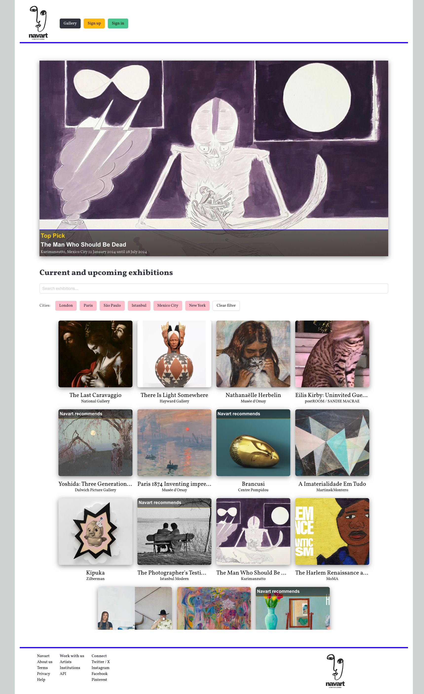
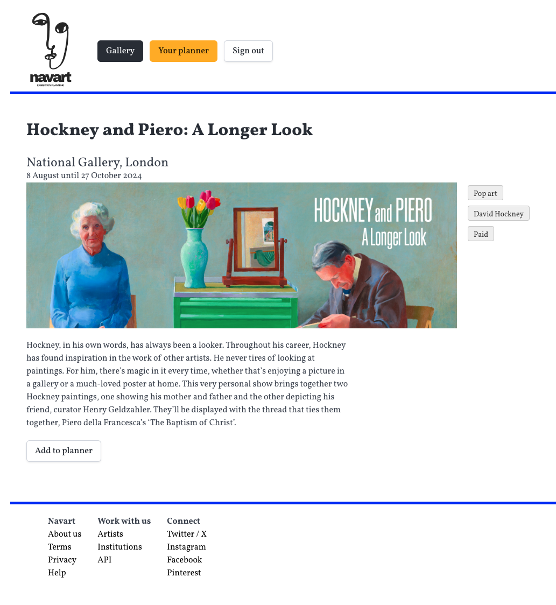
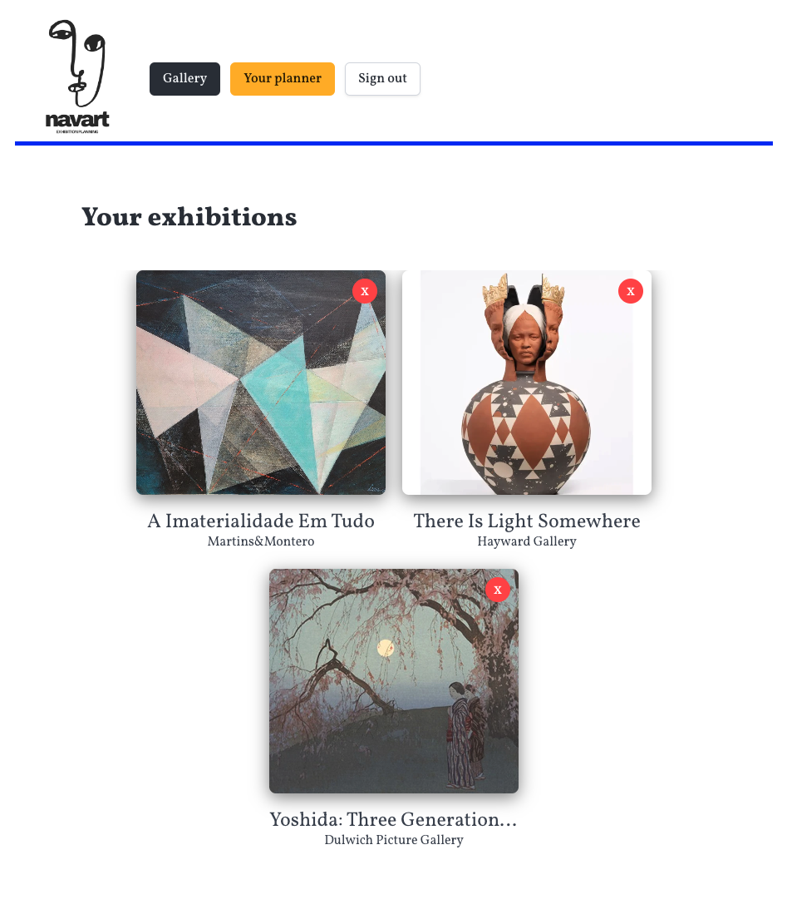

# Navart

## Background

Use [Navart](https://main--nav-art.netlify.app/ "Navart") to explore upcoming exhibitions in different cities. 

You can refer to the [backend repo](https://github.com/EmmaFrith/exhibition-calendar-backend "Backend repo"). 

## Features

Navart allows you to:

* save and remove exhibitions from your personal planner
* see which exhibitions are recommended by Navart
* filter exhibitions by city
* search exhibitions by keywords such as the artist name

Navart also notifies you when:

* you try to add the same exhibition to your planner twice
* exhibitions in your planner have ended 

## Future enhancements 

Future enhancements could include:

* adding a calendar to the planner page so that you can add exhibitions to a calendar
* paginating the 'gallery' page which features all the exhibitions
* enabling users to see each other's planners
* allowing comments 
* improving the form for creating an exhibition, for example allowing admins to add line breaks in descriptions
* providing more specific error messages
* making the site mobile responsiveness

## Screenshots

### The Navart homepage

### Signed in users can add an exhibition to planner 

### Planner 

## Technologies used

This site deployed using Netlify and built using various technologies such as:

* Vite
* React
* React DOM
* React Router DOM
* Axios
* React Toastify
* Express
* bcrypt
* Mongoose

## Planning materials 

